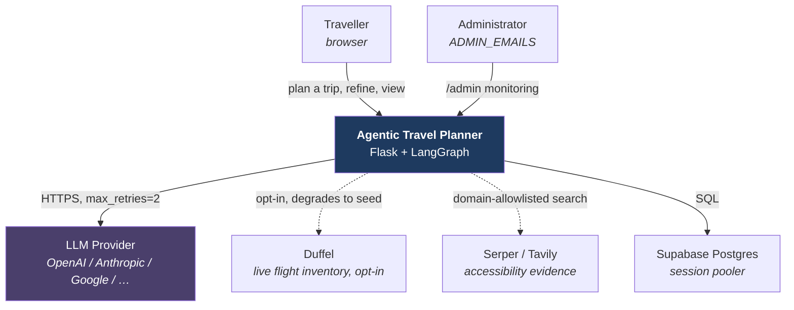
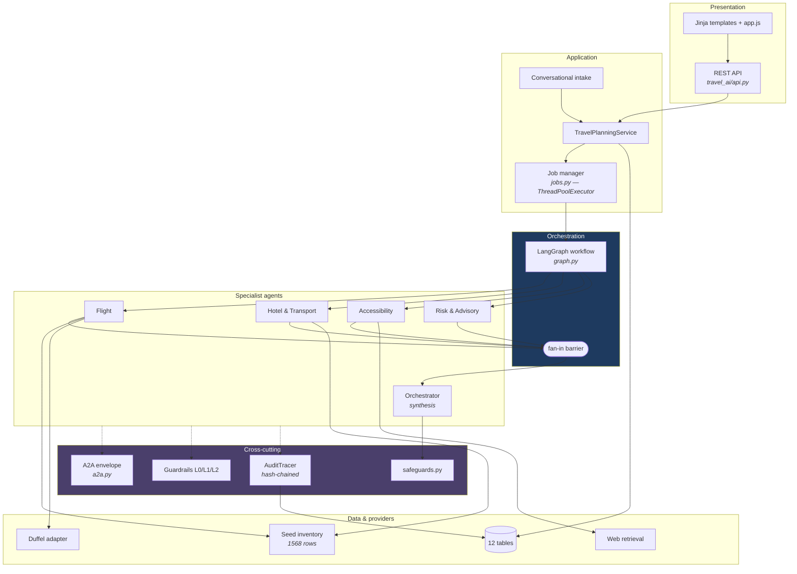
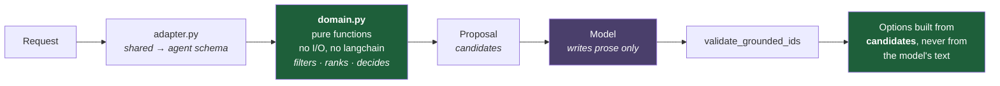
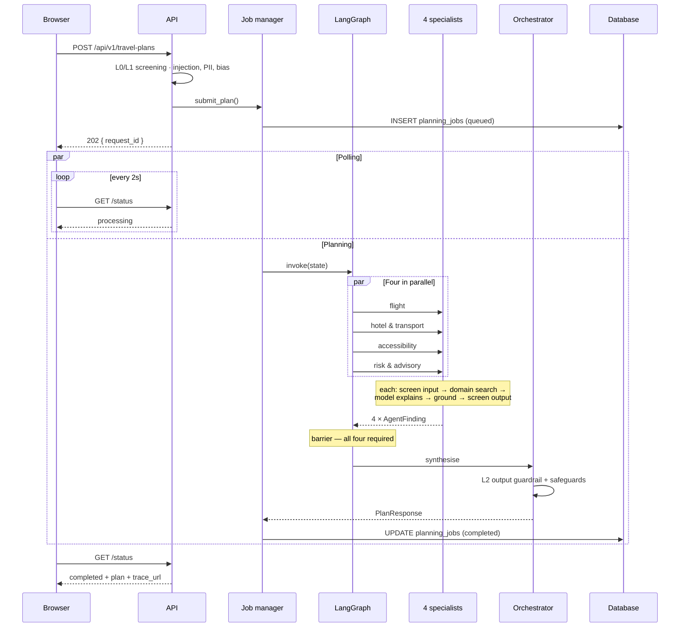
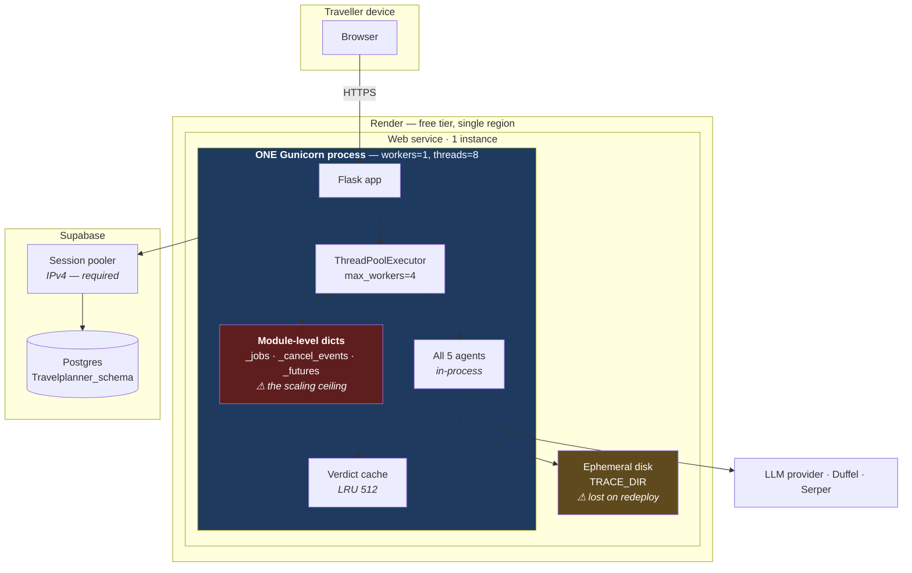
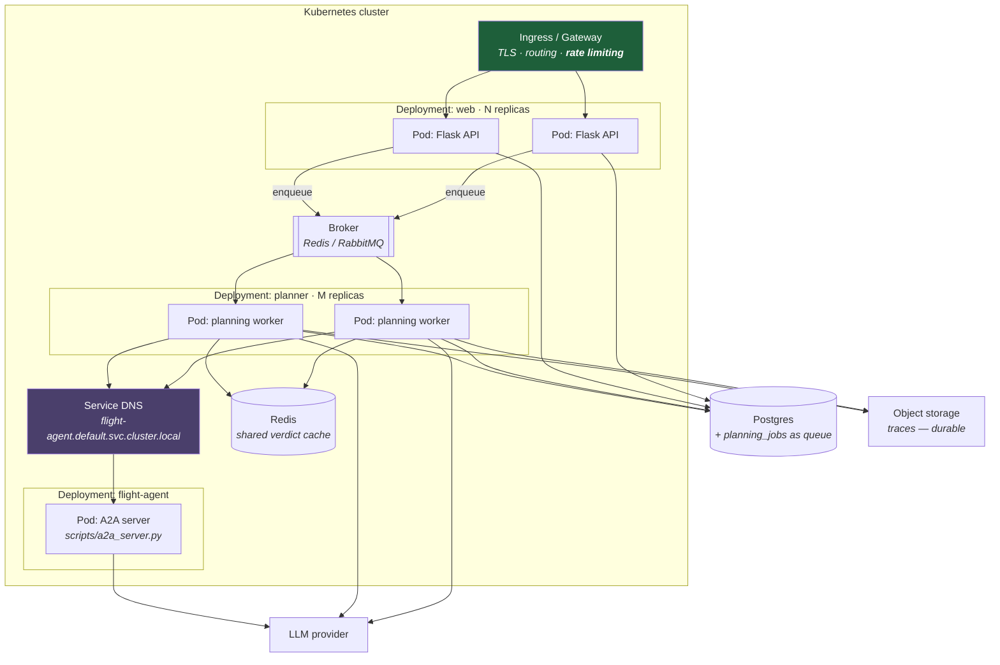
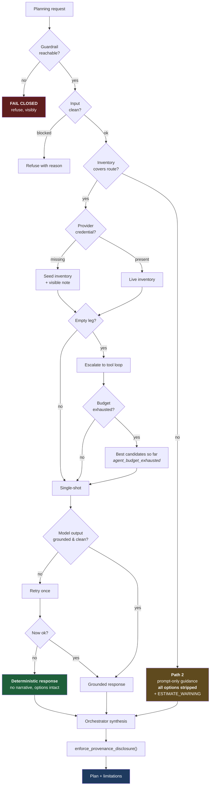
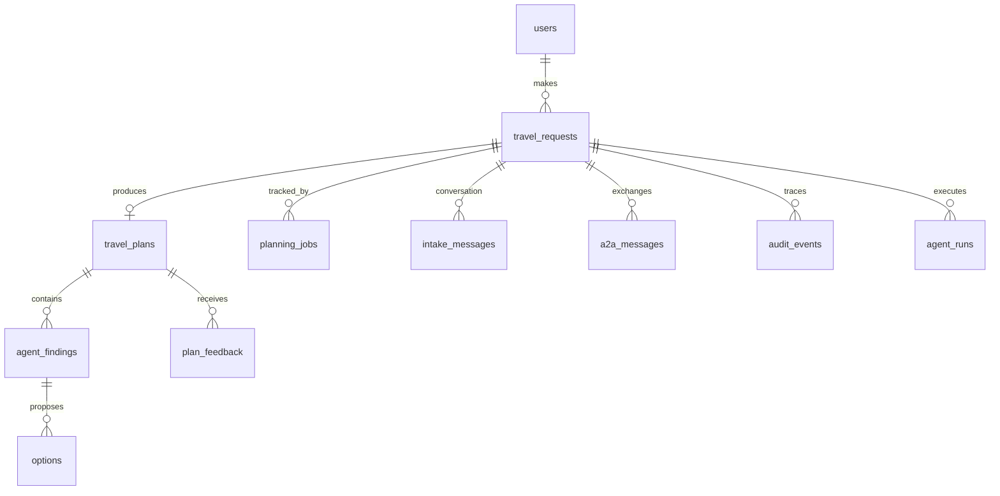

# Architecture

Five views of the same system, each answering a different question. Decisions
referenced as **ADR-nnnn** are recorded in [`docs/adr/`](adr/README.md).

| View | Question it answers |
|---|---|
| [Context](#1-context) | Who uses it, what it depends on |
| [Logical](#2-logical-view) | How responsibility is divided |
| [Process](#3-process-view) | What happens during one plan |
| [Physical](#4-physical-view--as-deployed-today) | Where the code actually runs |
| [Degradation](#6-degradation-ladder) | What happens when something breaks |

**Logical vs physical, since the distinction does most of the work here:** the
logical view shows five agents. The physical view shows *one process*. Five
components, one deployable — and the gap between those two numbers is the
scalability discussion (ADR-0013).

---

## 1. Context

Dotted edges are **optional dependencies**: absence degrades a feature, it does
not stop a plan (ADR-0011). The LLM provider is the one hard external
dependency.

---

## 2. Logical view

How responsibility divides, independent of where code runs.

### The layering rule that matters

Inside Flight and Hotel & Transport there is a further split that is the
system's central design decision (ADR-0002):

Green is deterministic and reviewable; purple is probabilistic. **Facts only
ever flow through green.** Remove the model and the wording degrades, not the
candidate list.

---

## 3. Process view

One plan, end to end.

Two things worth reading off this diagram:

- **The client is never blocked.** `202` returns immediately; the work runs on a
  thread and is polled. That is asynchronous request-reply — already built, and
  the reason an asyncio rewrite would add nothing (ADR-0014).
- **The barrier is a data dependency.** The orchestrator needs all four findings
  to synthesise. No concurrency model removes that wait.

---

## 4. Physical view — as deployed today

**Read this diagram as the honest one.** Five agents, one process, one instance.
Two constraints are marked in red and amber because they are the two facts an
examiner should hear from you before they find them:

1. **Job state in module-level dicts** caps the system at one worker. A second
   worker answers `GET /status` for jobs it never ran → 404 while the plan runs
   fine in its sibling (ADR-0005).
2. **`TRACE_DIR` is ephemeral.** Trace URLs 404 after a redeploy, though
   `audit_events` still holds the same events (ADR-0006).

The direct Supabase host resolves only to IPv6 and Render cannot reach it — the
session pooler is not a preference, it is the only route that works.

---

## 5. Physical view — target state

What the system becomes **after** the prerequisite is fixed. The prerequisite is
not Kubernetes; it is moving job state into the `planning_jobs` table.

### What this diagram is claiming, and what it isn't

| Element | Status | Note |
|---|---|---|
| Separate flight-agent service | **Seam already built** | `FLIGHT_AGENT_TRANSPORT=a2a` routes that one agent; `A2A_INTERNAL_ENABLED=true` routes all four, which is what the GKE deployment uses. Same tests pass either way (ADR-0004) |
| One image, three roles | **Follows from the above** | Web, planner and flight-agent are the same image with different commands (ADR-0013) |
| Service discovery via DNS | **Config change only** | `FLIGHT_AGENT_A2A_URL` is already externalised — no discovery client needed |
| Broker | **Not built** | The DB job table is already a queue; a broker earns its place past one node (ADR-0005) |
| Shared Redis cache | **Not built** | Becomes correct the moment workers > 1 (ADR-0010) |
| Rate limiting at ingress | **Not built anywhere** | A real gap today — the first thing a gateway buys |
| Service mesh | **Deliberately absent** | Cardinality: 5 services, one language, one team (ADR-0012) |

The honest summary for a reviewer: **the decomposition boundary is exercised
code, not a hopeful arrow.** Everything else on this diagram is a documented
migration path with a named trigger condition.

---

## 6. Degradation ladder

Every partial failure has a defined, *visible* fallback (ADR-0011).

**Two principles, and the asymmetry between them is the point.**

Everything degrades **open** — a worse answer beats no answer — *except* the
guardrail, which degrades **closed**. A safety control that waves traffic
through when it breaks is not a safety control.

And no degradation is silent. `enforce_provenance_disclosure()` exists because a
warning *was once* paraphrased into something milder during synthesis, and no
unit test caught it — each tested one agent's output, never what the
orchestrator did with it downstream. The discipline is now enforced
structurally, because prose alone demonstrably failed.

---

## 7. Data view

Twelve tables, dual DDL for SQLite and Postgres (ADR-0006).

The shape is relational because the assessed question is relational: *which
agent produced this option, in which run, under which request, and what did the
audit chain say at the time.* That is a join, not a document fetch — and it is
why there is no vector store (ADR-0007): grounding here is **exact identifier
membership**, which is decidable, not semantic similarity, which is not.

`audit_events` is the durable record. The JSONL trace files are a debugging
convenience on ephemeral disk, and any aggregation must read the table instead
(ADR-0015).
