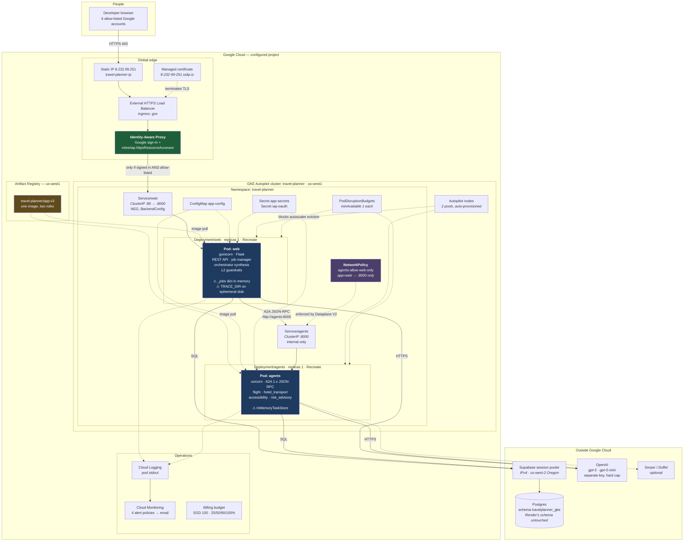

# Physical architecture — GKE, as deployed

Where the code actually runs, as of **2026-09-19**. This is the deployed
reality, not a target state: every box below exists and can be listed with
`kubectl`. The Render deployment is unchanged and still live; the two share a
Supabase project but not a schema.

Slots into [`architecture.md`](architecture.md) as a third physical view,
between §4 (Render, one process) and §5 (target state). Icons are deliberately
left out — the component table at the end has a blank column for them.

---

## 1. The diagram



---

## 2. The same thing as a box drawing

For slides, where mermaid is inconvenient and icons go on top.

```
                         Developer browser  (6 allow-listed Google accounts)
                                     |
                                     |  HTTPS 443
                                     v
   ============================ GOOGLE CLOUD =================================
   |                                                                         |
   |   8.232.99.251  ->  External HTTPS LB  ->  [ IAP: Google sign-in ]      |
   |   (static IP)       (managed cert,          + IAM allow-list            |
   |                      HTTP->HTTPS)           ------------------          |
   |                                                    |                    |
   |   +--------------------- GKE Autopilot · us-west1 --|-----------------+  |
   |   |          namespace: travel-planner              v                 |  |
   |   |                                        Service/web  :80           |  |
   |   |                                               |                   |  |
   |   |   Artifact Registry                   +-------v--------+          |  |
   |   |   app:v3  -- pull -->                 |   POD: web     |          |  |
   |   |       |                               |   gunicorn     |          |  |
   |   |       |                               |   Flask API    |          |  |
   |   |       |                               |   job manager  |          |  |
   |   |       |                               |   orchestrator |          |  |
   |   |       |                               +-------+--------+          |  |
   |   |       |                                       |                   |  |
   |   |       |                     A2A JSON-RPC over http://agents:8000  |  |
   |   |       |                            [ NetworkPolicy: web only ]    |  |
   |   |       |                                       |                   |  |
   |   |       |                               Service/agents :8000        |  |
   |   |       |                                       |                   |  |
   |   |       |                               +-------v--------+          |  |
   |   |       +----------- pull ------------> |  POD: agents   |          |  |
   |   |                                       |  uvicorn       |          |  |
   |   |                                       |  4 specialists |          |  |
   |   |                                       +-------+--------+          |  |
   |   +-----------------------------------------------|-----------------+ |  |
   |                                                    |                   |
   |   Cloud Monitoring (4 alerts)  ·  Cloud Logging  ·  Budget SGD 100     |
   ==========================================|===============================
                                             |
              +------------------------------+-----------------------------+
              |                              |                             |
              v                              v                             v
   Supabase session pooler          OpenAI  gpt-5 / gpt-5-mini      Serper / Duffel
   schema travelplanner_gke         (separate key, hard cap)        (optional)
   (Render's schema untouched)
```

---

## 3. Components

The icon column is left blank on purpose.

| Icon | Component | Kind | Where | Count |
|---|---|---|---|---|
| | Static IP `travel-planner-ip` | Google Cloud | global | 1 |
| | External HTTPS load balancer | `Ingress` (gce) | global | 1 |
| | Managed certificate | `ManagedCertificate` | global | 1 |
| | HTTP → HTTPS redirect | `FrontendConfig` | global | 1 |
| | Identity-Aware Proxy | `BackendConfig` + IAM | global | 1 |
| | Cluster `travel-planner` | GKE Autopilot | `us-west1` | 1 |
| | Nodes | auto-provisioned | 2 pools | 4 |
| | `web` | `Deployment` + `Service` | namespace | 1 pod |
| | `agents` | `Deployment` + `Service` | namespace | 1 pod |
| | `agents-allow-web-only` | `NetworkPolicy` | namespace | 1 |
| | `app-config` | `ConfigMap` | namespace | 1 |
| | `app-secrets`, `iap-oauth` | `Secret` | namespace | 2 |
| | PodDisruptionBudgets | `PDB` | namespace | 2 |
| | `travel-planner/app:v3` | container image | Artifact Registry `us-west1` | 1 image, 2 roles |
| | Alert policies | Cloud Monitoring | project | 4 |
| | Budget | Cloud Billing | account | 1 |
| | Postgres | Supabase (external) | `us-west-2` | schema `travelplanner_gke` |
| | Model provider | OpenAI (external) | — | `gpt-5`, `gpt-5-mini` |

---

## 4. Reading the diagram

**One image, two roles.** `web` and `agents` are the same bytes from Artifact
Registry started with different commands. That is ADR-0013's decision, and it is
why a version can never be half-deployed: both roles move together or neither
does.

**The only public door is IAP.** There is no route to `agents` from outside the
cluster and no second Ingress. A request reaches Flask only after Google sign-in
*and* an IAM check — including `/register` and the login page, which is what
makes an open sign-up form acceptable here for now.

**The NetworkPolicy is load-bearing, not decoration.** The A2A endpoints have no
authentication of their own, and every call spends the provider key. The policy
is what makes `A2A_TRUST_CALLER_REQUEST_ID=true` safe on the agents role, since
a trusted request id is a write key into another plan's audit trail.

**Two warnings are drawn in, not hidden.** `_jobs` in pod memory and
`InMemoryTaskStore` are why both Deployments say `replicas: 1`. See
[ADR-0017](adr/0017-fix-data-location-before-adding-replicas.md).

**Both roles talk to Postgres and to OpenAI.** The agents pod is not a pure
compute worker — specialists write their own audit events and make their own
model calls. That is why the connection-per-call problem is counted across both
pods, not just `web`.

---

## 5. What is proved, and by what

Every arrow above has something that checks it, so the diagram is not a drawing
of intent.

| Claim in the diagram | Proved by |
|---|---|
| Two roles, one image, two commands | `python deploy/prove_topology.py` |
| Separate pods, IPs, resource accounting | same |
| `agents` has no public door | same (Ingress backends) |
| NetworkPolicy admits `web` only | same |
| `web` is wired to the Service, not localhost | same |
| Specialists really answer over the network | `python deploy/smoke_test.py` |
| Restarting `agents` does not touch `web` | `prove_topology.py --restart-agents` |
| The platform will run two pods | `prove_topology.py --scale web=2` |
| A session works on either pod | `prove_topology.py --scale web=2 --session-portability` |
| Plans do **not** yet survive two pods | `deploy/load_test.py --plans 2` at 2 replicas — expected to FAIL today |
